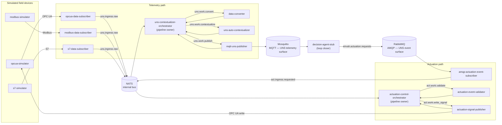

# EirVah Edge Code

Edge Integration Layer for the **EirVah** reference architecture — a scalable, cost-efficient, open reference architecture for Unified Namespace (UNS) in Industrial IoT.

This repo is the implementation half of William Francis Stack's PhD work at the University of Žilina (supervisor: Aleš Janota). Scope is **the edge only** — protocol adapters, contextualizers, and publishers that translate industrial signals into the UNS over MQTT/AMQP, plus the actuation path back to devices. The cloud-side layers (persistence, decision/analytics) live in sibling repos.

## What's here

- The Edge Integration Layer running on Kubernetes (local dev via [`kind`](https://kind.sigs.k8s.io/)), validated against simulated OPC UA, Modbus, and S7 bottling-line devices.
- Both halves of the CPS feedback loop: telemetry (device → UNS over MQTT) and actuation (UNS event → device write-back over AMQP).
- All open source. No proprietary dependencies.
- Implementation status and active plans: [`docs/superpowers/plans/`](docs/superpowers/plans/).

## Architecture

Two orchestrated pipelines share a NATS bus at the edge. Orchestrators own pipeline state; the pods either side of them are stateless NATS request-reply workers.



Prometheus scrapes `/metrics` from every pod (including the three brokers); Grafana ships two pre-provisioned dashboards ("EirVah Edge Pipeline" and "Bottling Line State"). Full component contracts, NATS subject list, and the UNS topic/payload schemas live in the design spec below.

## Accessing each part

None of this is exposed outside the cluster by default — `kubectl -n eirvah-edge port-forward svc/<name> <local>:<remote>` first (`dev_up.sh` prints the exact commands). Credentials below are dev-only defaults from `deploy/k3s/base/*/secret.yaml` — regenerate before using this outside a local sandbox.

| Component | Port-forward | URL / address | Credentials |
|---|---|---|---|
| Grafana | `svc/grafana 3000:3000` | http://localhost:3000 | `admin` / `eirvah-dev-grafana` |
| Prometheus | `svc/prometheus 9090:9090` | http://localhost:9090 | none (no auth) |
| RabbitMQ management UI | `svc/rabbitmq 15672:15672` | http://localhost:15672 | `eirvah` / `eirvah-dev-password` |
| RabbitMQ AMQP | `svc/rabbitmq 5672:5672` | `amqp://localhost:5672` | `eirvah` / `eirvah-dev-password` |
| Mosquitto (MQTT) | `svc/mosquitto 1883:1883` | `mqtt://localhost:1883` | `eirvah` / `eirvah-dev-password` (anonymous auth disabled) |
| NATS | `svc/nats 4222:4222` | `nats://localhost:4222` | none (no auth, no JetStream) |
| OPC UA simulator | `svc/opcua-simulator 4840:4840` | `opc.tcp://localhost:4840` | none |
| Modbus simulator | `svc/modbus-simulator 5020:5020` | `localhost:5020` | none |
| S7 simulator | `svc/s7-simulator 102:102` | `localhost:102` | none |

## Key documents

- Spec: [`docs/superpowers/specs/2026-05-16-eirvah-edge-vertical-slice-design.md`](docs/superpowers/specs/2026-05-16-eirvah-edge-vertical-slice-design.md)
- Plans: [`docs/superpowers/plans/`](docs/superpowers/plans/)
- PhD proposal (companion): `UNIZA_Project_Proposal__EirVah__...pdf`

## Prerequisites

- macOS, Linux, or Windows (Git Bash/WSL)
- Python 3.12 (managed by uv — no system Python needed)
- [uv](https://github.com/astral-sh/uv)
- Docker
- [kind](https://kind.sigs.k8s.io/)
- kubectl (bundles kustomize — no separate kustomize binary needed)

## Getting started

```bash
uv sync                       # install workspace + dev deps
./scripts/dev_up.sh           # create kind cluster, build, deploy
# Grafana + port-forward hints printed at the end; open Grafana and switch to
# the "Bottling Line State" or "EirVah Edge Pipeline" dashboard
./scripts/dev_down.sh         # tear it all down
```

## Licensing

This repo is Apache-2.0 licensed. Every runtime and build dependency is OSI-approved open source.
