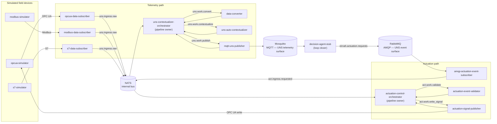

# EirVah Edge Code

Edge Integration Layer for the **EirVah** reference architecture — a scalable, cost-efficient, open reference architecture for Unified Namespace (UNS) in Industrial IoT.

This repo is the implementation half of William Francis Stack's PhD work at the University of Žilina (supervisor: Aleš Janota). Scope is **the edge only** — protocol adapters, contextualizers, and publishers that translate industrial signals into the UNS over MQTT/AMQP, plus the actuation path back to devices. The cloud-side layers (persistence, decision/analytics) live in sibling repos.

## What's here

- The Edge Integration Layer running on Kubernetes (local dev via [`kind`](https://kind.sigs.k8s.io/)), validated against simulated OPC UA, Modbus, and S7 bottling-line devices.
- Both halves of the CPS feedback loop: telemetry (device → UNS over MQTT) and actuation (UNS event → device write-back over AMQP).
- All open source. No proprietary dependencies.
- Implementation status and active plans: [`docs/superpowers/plans/`](docs/superpowers/plans/).

## Architecture

Two orchestrated pipelines share a NATS bus at the edge. Orchestrators own pipeline state; the pods either side of them are stateless NATS request-reply workers.



Prometheus scrapes `/metrics` from every pod (including the three brokers); Grafana ships two pre-provisioned dashboards ("EirVah Edge Pipeline" and "Bottling Line State"). Full component contracts, NATS subject list, and the UNS topic/payload schemas live in the design spec below.

## Services

### Simulated field devices

- **`opcua-simulator`** — Custom `asyncua` OPC UA server exposing a bottling-line address space (temperature sensor, throughput meter, motor, and a writable setpoint). Deterministic given a seed, and exposes its own internal state as Prometheus gauges, so the device's ground truth is observable in Grafana independently of whether the pipeline is working correctly.
- **`modbus-simulator`** — Modbus TCP server simulating a filler station (fill level, motor state, and related holding registers) on the same tick-driven model as the OPC UA simulator.
- **`s7-simulator`** — Siemens S7 server (via `python-snap7`) simulating a capper (DB1) and palletizer (DB2) as S7 data blocks — a third protocol shape for the edge layer to normalize, alongside OPC UA and Modbus.

### Telemetry path (device → UNS over MQTT)

- **`opcua-data-subscriber`** — Subscribes to the OPC UA simulator's monitored items and forwards each `DataChange` as a JSON envelope onto NATS subject `uns.ingress.raw`. Reconnects with exponential backoff on disconnect.
- **`modbus-data-subscriber`** — Polls the Modbus simulator's holding registers on an interval (Modbus has no native push/subscribe) and publishes the same raw-signal envelope onto `uns.ingress.raw`.
- **`s7-data-subscriber`** — Polls the S7 simulator's data blocks and publishes onto `uns.ingress.raw`, following the same envelope contract as the other two subscribers.
- **`uns-contextualizer-orchestrator`** — Owns the telemetry pipeline. Consumes `uns.ingress.raw` and drives each message through `uns.work.convert` → `uns.work.contextualize` → `uns.work.publish` as NATS request-reply calls with per-stage timeouts, dead-lettering to `uns.dlq.telemetry` on failure and emitting per-stage and end-to-end latency metrics.
- **`data-converter`** — Worker on `uns.work.convert`. Normalizes raw values: unit conversion (e.g. Kelvin→Celsius), type coercion, and quality filtering, driven by a per-node-id conversion-rules ConfigMap.
- **`uns-auto-contextualizer`** — Worker on `uns.work.contextualize`. Maps a source node/register/data-block address to its canonical 7-level ISA-95 UNS topic and attaches semantic metadata (unit, type, source descriptor). The only worker with a `HorizontalPodAutoscaler` (1→5 replicas), since it's the pipeline's heaviest lookup stage.
- **`mqtt-uns-publisher`** — Worker on `uns.work.publish`. Publishes the contextualized payload to Mosquitto at the resolved UNS topic, default QoS 1.

### Actuation path (UNS event → device write-back over AMQP)

- **`amqp-actuation-event-subscriber`** — Consumes the `eirvah.actuation.requests` queue on RabbitMQ and re-emits each request as a NATS envelope on `act.ingress.requested`, acking the AMQP delivery only after the NATS publish succeeds (at-least-once into the edge).
- **`actuation-control-orchestrator`** — Owns the actuation pipeline. Drives `act.work.validate`; on approval, drives `act.work.write_signal`; on rejection, dead-letters to `act.dlq.rejected` and stops. Gated by an `allow_writes` feature flag (default `false`) so writes to the device are opt-in.
- **`actuation-event-validator`** — Worker on `act.work.validate`. Checks that the target UNS topic resolves to a writable node, the requested value is within the configured policy range, and the requester is allow-listed (`config/actuation-policy.yaml`). Returns `approve` or `reject` with a reason.
- **`actuation-signal-publisher`** — Worker on `act.work.write_signal`. Resolves the UNS topic back to its OPC UA node ID (the reverse of the contextualizer's mapping) and performs the write against the OPC UA simulator, closing the loop.

### Loop-closer and infrastructure

- **`decision-agent-stub`** — Subscribes to UNS topics on Mosquitto; when the bottling-line temperature crosses a configured threshold, publishes an actuation request onto RabbitMQ targeting the writable setpoint. The only "fake" component in the slice — it stands in for the real decision/analytics layer, which lives in a sibling repo.
- **`nats`** — Single-replica NATS server (no JetStream) — the internal request-reply bus both orchestrators run on.
- **`mosquitto`** — Single-replica MQTT broker; the public UNS telemetry surface. Anonymous auth disabled, basic credentials from a Secret.
- **`rabbitmq`** — Single-replica RabbitMQ with the management and Prometheus plugins enabled; the public UNS event surface for actuation requests, with queues/users declared via a definitions file.
- **`prometheus`** — Scrapes `/metrics` from every workload pod, the three brokers, and kubelet cAdvisor.
- **`grafana`** — Two pre-provisioned dashboards: "EirVah Edge Pipeline" (message flow and latency) and "Bottling Line State" (device ground truth).
- **`kube-state-metrics`** — Exposes Kubernetes object state (pods, deployments, HPAs) scoped to the `eirvah-edge` namespace, feeding the autoscaling dashboard.

## Accessing each part

None of this is exposed outside the cluster by default — `kubectl -n eirvah-edge port-forward svc/<name> <local>:<remote>` first (`dev_up.sh` prints the exact commands). Credentials below are dev-only defaults from `deploy/k3s/base/*/secret.yaml` — regenerate before using this outside a local sandbox.

| Component | Port-forward command | URL / address | Credentials |
|---|---|---|---|
| Grafana | `kubectl -n eirvah-edge port-forward svc/grafana 3000:3000` | http://localhost:3000 | `admin` / `eirvah-dev-grafana` |
| Prometheus | `kubectl -n eirvah-edge port-forward svc/prometheus 9090:9090` | http://localhost:9090 | none (no auth) |
| RabbitMQ management UI | `kubectl -n eirvah-edge port-forward svc/rabbitmq 15672:15672` | http://localhost:15672 | `eirvah` / `eirvah-dev-password` |
| RabbitMQ AMQP | `kubectl -n eirvah-edge port-forward svc/rabbitmq 5672:5672` | `amqp://localhost:5672` | `eirvah` / `eirvah-dev-password` |
| Mosquitto (MQTT) | `kubectl -n eirvah-edge port-forward svc/mosquitto 1883:1883` | `mqtt://localhost:1883` | `eirvah` / `eirvah-dev-password` (anonymous auth disabled) |
| NATS | `kubectl -n eirvah-edge port-forward svc/nats 4222:4222` | `nats://localhost:4222` | none (no auth, no JetStream) |
| OPC UA simulator | `kubectl -n eirvah-edge port-forward svc/opcua-simulator 4840:4840` | `opc.tcp://localhost:4840` | none |
| Modbus simulator | `kubectl -n eirvah-edge port-forward svc/modbus-simulator 5020:5020` | `localhost:5020` | none |
| S7 simulator | `kubectl -n eirvah-edge port-forward svc/s7-simulator 102:102` | `localhost:102` | none |

## Key documents

- Spec: [`docs/superpowers/specs/2026-05-16-eirvah-edge-vertical-slice-design.md`](docs/superpowers/specs/2026-05-16-eirvah-edge-vertical-slice-design.md)
- Plans: [`docs/superpowers/plans/`](docs/superpowers/plans/)
- Manual demo tests (actuation success/failure, disturbance): [`TESTING.md`](TESTING.md)
- PhD proposal (companion): `UNIZA_Project_Proposal__EirVah__...pdf`

## Prerequisites

- macOS, Linux, or Windows (Git Bash/WSL)
- Python 3.12 (managed by uv — no system Python needed)
- [uv](https://github.com/astral-sh/uv)
- Docker
- [kind](https://kind.sigs.k8s.io/)
- kubectl (bundles kustomize — no separate kustomize binary needed)

## Getting started

```bash
uv sync                       # install workspace + dev deps
./scripts/dev_up.sh           # create kind cluster, build, deploy
# Grafana + port-forward hints printed at the end; open Grafana and switch to
# the "Bottling Line State" or "EirVah Edge Pipeline" dashboard
./scripts/dev_down.sh         # tear it all down
```

## Licensing

This repo is Apache-2.0 licensed. Every runtime and build dependency is OSI-approved open source.
